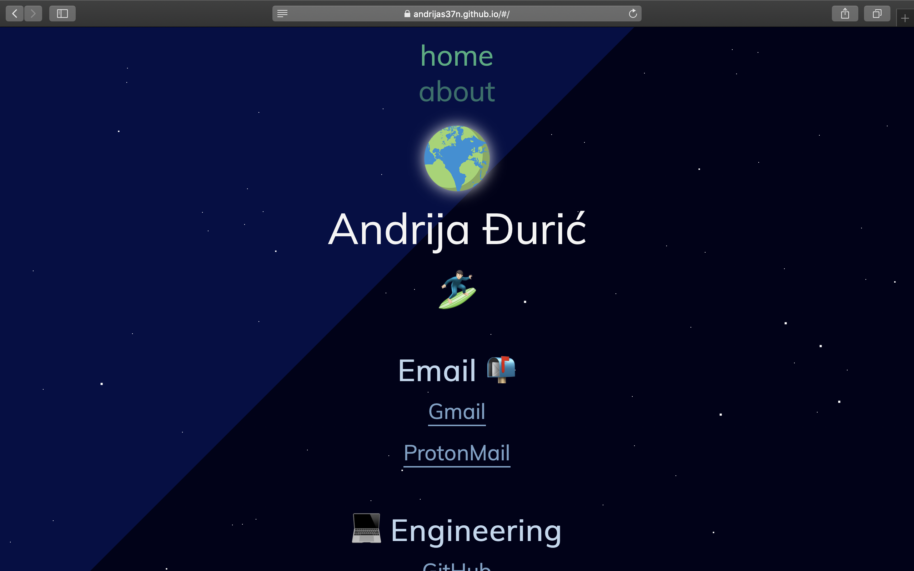
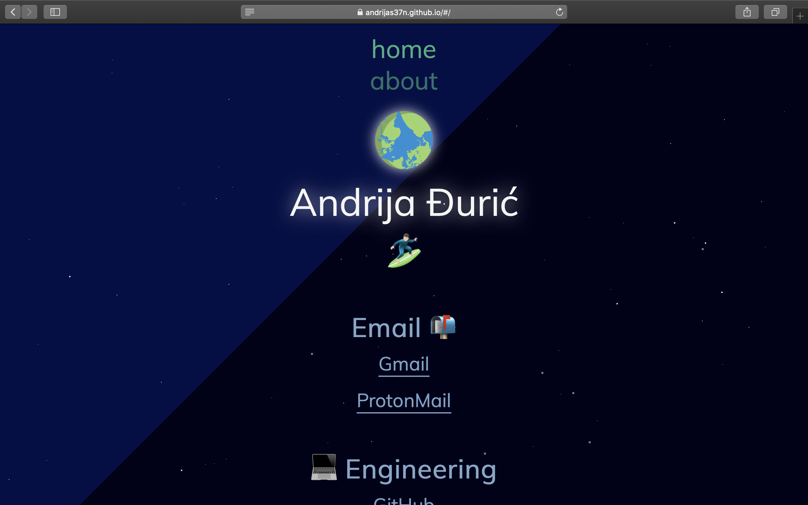
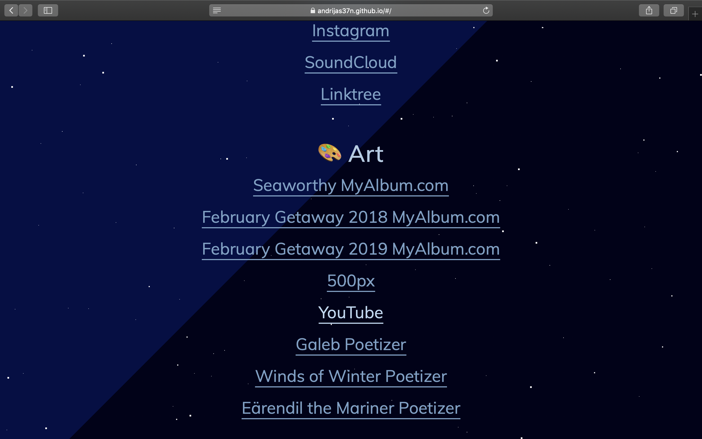
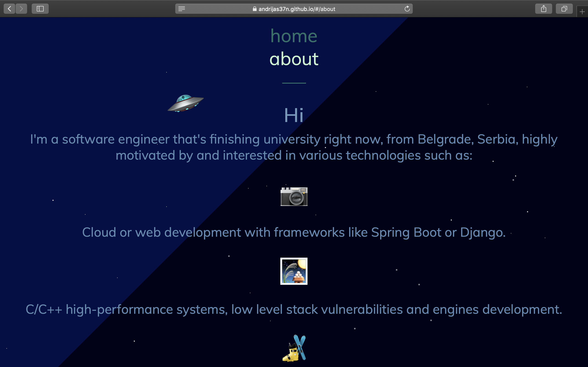
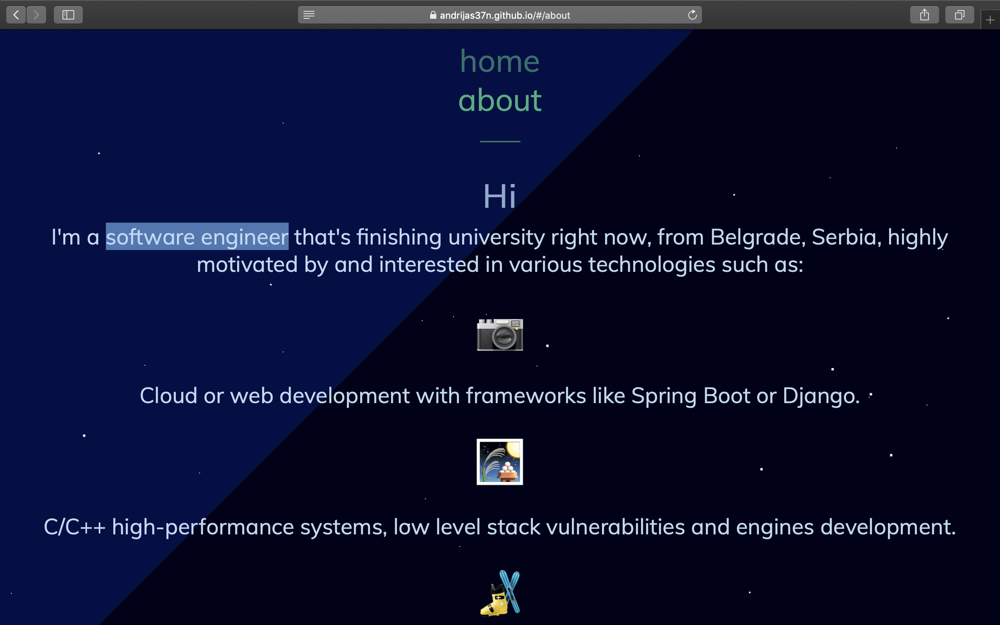
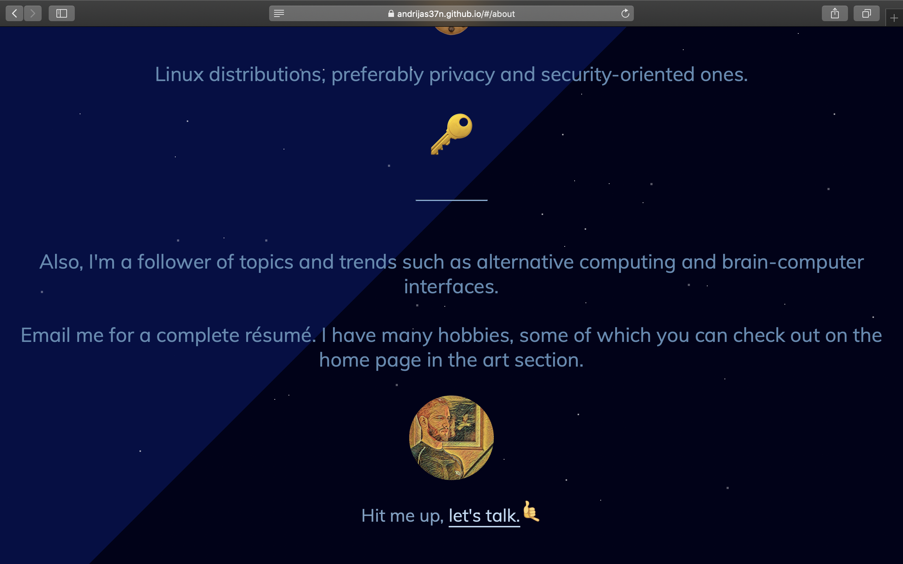
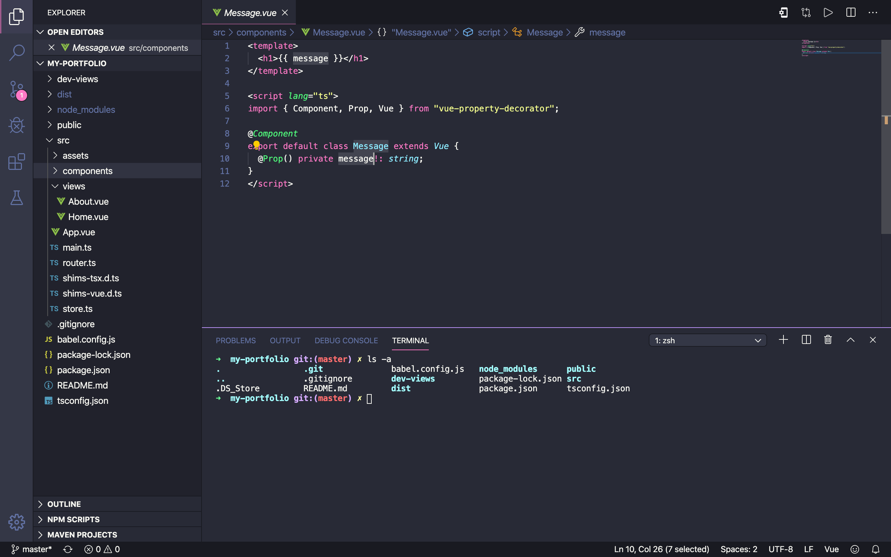

# My Portfolio Development Repository
The development repository for my website hosted on GitHub Pages.

## Description
Made with Vue.js framework. It's a nice framework. The website supports various browsers and has a portable design. Looks good on mobile devices and tablets as well.
Languages and techs used:

1. TypeScript
1. CSS & SCSS
1. Regular HTML

Live website on GitHub Pages: [AndrijaS37N.github.io](https://andrijas37n.github.io/#/). Possible node_modules vulnerabilities found in package-lock.json. For example:
```
"dependencies": {
  "tar": ">=4.4.2"
}
```

But I think I may have resolved or deleted this requirement already.

## Testing Emojis
Chosen emojis have been tested and work on these platforms and more specifically operating systems:

1. MS Windows 10 +
1. Linux Ubuntu 18.04 +
1. MacOS 10.14 +


Vue-cli was used to create the project and the starting dependencies. There is a vue-gui neesh functionality as well, a UI for the browser for an easier management.

#### Views:
<h6>Home &#x2198;</h6>

<h6>Home With Starlight &#x2198;</h6>

<h6>Bottom Of Home Page &#x2198;</h6>

<h6>About &#x2198;</h6>

<h6>About With Starlight &#x2198;</h6>

<h6>Bottom Of About Page &#x2198;</h6>

<h6>VS Code Development View &#x2198;</h6>


Auto-generated part of the README is below.

## Project setup
```
npm install
```

### Compiles and hot-reloads for development
```
npm run serve
```

### Compiles and minifies for production
```
npm run build
```

### Run your tests
```
npm run test
```

### Lints and fixes files
```
npm run lint
```

### Customize configuration
See [Configuration Reference](https://cli.vuejs.org/config/).
